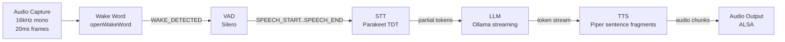

# CLAUDE.md — Helix OS Development Context

> This file provides Claude Code (and all AI-assisted development tools) with the full context needed to write code, make architecture decisions, and generate documentation for the Helix project. Read this file completely before generating any code.

---

## Project Overview

Helix is a fully modular, open-source AI home assistant built on Raspberry Pi 5. It is the "Linux PC of smart speakers" — every hardware component is swappable, every software layer is programmable, and all AI inference runs locally on-device with no cloud dependency. The software framework is called **HelixOS** and is licensed under Apache 2.0.

**Company:** Attune Labs, Inc. (Delaware C-Corp)
**Founder:** Sabir
**Repository:** This is the `helix-os` monorepo containing all HelixOS software.
**Companion repos:** `helix-hardware` (PCB/enclosure designs, CC BY-SA 4.0), `helix-docs` (documentation site, CC BY 4.0)

---

## Architecture: Five-Layer Stack

HelixOS is organized in five layers. Each layer communicates with its neighbors through internal APIs and is independently replaceable. When writing code, always respect layer boundaries — a module in Layer 2 should never import directly from Layer 4.

```
┌─────────────────────────────────────────────────┐
│  Layer 4: Skills & Integrations (helix_skills)  │  Python plugin packages
├─────────────────────────────────────────────────┤
│  Layer 3: AI Reasoning Engine (helix_mind)      │  Ollama / hailo-ollama, memory, tool dispatch
├─────────────────────────────────────────────────┤
│  Layer 2: Voice Pipeline Engine (helix_voice)   │  Streaming DAG: wake → VAD → STT → TTS
├─────────────────────────────────────────────────┤
│  Layer 1: Hardware Abstraction Layer (helix_hal)│  Device discovery, audio routing, LED, sensors
├─────────────────────────────────────────────────┤
│  Layer 0: Raspberry Pi OS (Debian Bookworm)     │  Unmodified upstream + HelixOS apt packages
└─────────────────────────────────────────────────┘
```

---

## Directory Structure

```
helix-os/
├── CLAUDE.md                  # This file
├── ARCHITECTURE.md            # Public-facing architecture doc (with Mermaid diagrams)
├── CONTRIBUTING.md
├── LICENSE                    # Apache 2.0
├── README.md
├── pyproject.toml
├── main.py                    # Entry point: starts HAL, pipeline, dashboard
│
├── src/
│   ├── helix_hal/
│   │   ├── __init__.py
│   │   ├── device_manager.py  # USB/I2C/GPIO scanning, device manifest (JSON), D-Bus
│   │   ├── audio_router.py    # ALSA device detection, auto-select mic/speaker, hotplug
│   │   ├── display_manager.py # HDMI/DSI detection, resolution scaling
│   │   ├── sensor_poller.py   # I2C sensor reading (BME280, SGP30, VEML7700)
│   │   └── led_controller.py  # WS2812B RGB ring via GPIO PWM (rpi_ws281x)
│   │
│   ├── helix_voice/
│   │   ├── __init__.py
│   │   ├── pipeline.py        # DAG orchestrator — wires all stages, manages state machine
│   │   ├── audio_capture.py   # Mic input: 16kHz, 16-bit mono, 20ms frames → asyncio.Queue
│   │   ├── audio_output.py    # Speaker output: ALSA direct write from TTS audio chunks
│   │   ├── wake_word.py       # openWakeWord wrapper, emits WAKE_DETECTED event
│   │   ├── vad.py             # Silero VAD (ONNX), emits SPEECH_START / SPEECH_END
│   │   ├── stt.py             # Pluggable STT: Parakeet TDT (default) or Faster-Whisper
│   │   └── tts.py             # Pluggable TTS: Piper (default) or Kokoro-82M (optional)
│   │
│   ├── helix_mind/
│   │   ├── __init__.py
│   │   ├── llm.py             # Ollama HTTP streaming client, system prompt management
│   │   ├── memory.py          # Sliding-window conversation history (in-memory → SQLite)
│   │   ├── tool_dispatch.py   # Routes LLM tool/function calls to skill plugins
│   │   └── npu.py             # Hailo-10H detection, hailo-ollama backend, keep-alive heartbeat
│   │
│   ├── helix_skills/
│   │   ├── __init__.py
│   │   ├── loader.py          # Scans ~/.helix/skills/, loads skill.yaml manifests
│   │   ├── registry.py        # Registers tool definitions with helix_mind
│   │   └── builtin/
│   │       ├── timer.py       # Timer and alarm skill
│   │       ├── weather.py     # Open-Meteo API (only default network dependency)
│   │       ├── home_auto.py   # MQTT publish, Zigbee, Matter-over-Thread (via ZBT-2)
│   │       ├── music.py       # MPD, Spotify Connect, Bluetooth audio
│   │       ├── memory_skill.py# User notes/preferences stored in SQLite
│   │       └── system.py      # Volume, brightness, restart, shutdown
│   │
│   └── helix_ui/
│       ├── api.py             # FastAPI backend, serves on port 8080
│       ├── static/            # React build output
│       └── frontend/          # React source (Vite + Tailwind)
│           ├── src/
│           │   ├── App.jsx
│           │   ├── pages/
│           │   │   ├── Status.jsx       # Device list, CPU/RAM/temp
│           │   │   ├── Conversation.jsx # Real-time transcription log
│           │   │   ├── Metrics.jsx      # Latency charts (STT, LLM TTFT, TTS, E2E)
│           │   │   ├── Settings.jsx     # Wake word, STT/LLM/TTS model selection
│           │   │   └── Skills.jsx       # Installed skills, enable/disable
│           │   └── components/
│           └── package.json
│
├── config/
│   ├── default.yaml           # Default configuration (models, thresholds, ports)
│   └── system_prompt.txt      # LLM system prompt for voice assistant persona
│
├── models/                    # .gitignore'd — downloaded at install time, not committed
│   ├── parakeet-tdt-0.11b/
│   ├── piper/
│   ├── silero-vad/
│   └── openwakeword/
│
└── tests/
    ├── test_audio_capture.py
    ├── test_wake_word.py
    ├── test_vad.py
    ├── test_stt.py
    ├── test_llm.py
    ├── test_tts.py
    ├── test_pipeline.py
    └── test_skills.py
```

---

## Voice Pipeline Architecture (Layer 2 — the core of the product)

The pipeline is a **streaming DAG** (Directed Acyclic Graph) of processing stages connected by `asyncio.Queue` instances. Each stage runs in its own coroutine (or thread for CPU-bound work). Data flows as small chunks, NOT complete utterances. This streaming design is what achieves low latency — stages overlap rather than running sequentially.

### Pipeline Flow



### Pipeline State Machine

```
IDLE → (wake word detected) → LISTENING → (speech end) → PROCESSING → (first audio plays) → SPEAKING → (response complete) → IDLE
```

LED colors track state: dim white = IDLE, blue pulse = LISTENING, yellow spin = PROCESSING, green pulse = SPEAKING.

### Critical Design Rules

1. **Never wait for a complete utterance before starting the next stage.** STT emits partial tokens while the user is still speaking. The LLM begins generating from partial transcription. TTS begins synthesis from the first sentence fragment. This overlap is what makes latency feel conversational.

2. **Sentence-boundary TTS triggering.** The TTS stage buffers LLM tokens until it detects a sentence boundary (`.`, `?`, `!`, or a configurable token-count threshold). It then synthesizes and plays that fragment while the LLM continues generating. Do NOT wait for the complete LLM response before starting TTS.

3. **All queues are bounded.** Use `asyncio.Queue(maxsize=N)` to prevent unbounded memory growth. If a downstream stage is slow, the upstream stage should apply backpressure, not buffer infinitely.

4. **Audio format is standardized.** All audio throughout the pipeline is 16kHz, 16-bit, mono PCM. Do not introduce sample rate conversions mid-pipeline.

---

## Technology Choices and Constraints

### Speech-to-Text (stt.py)

| Engine | WER | RTF (Pi 5) | RAM | Languages | License |
|--------|-----|-----------|-----|-----------|---------|
| **Parakeet TDT 0.11B (DEFAULT)** | 4.19% | 0.12 | 1.23 GB | English only | CC-BY-4.0 |
| Parakeet TDT 0.6B | 3.51% | 0.21 | 1.76 GB | English only | CC-BY-4.0 |
| Faster-Whisper distil-small | ~11% | ~0.29+ | ~1.4 GB | 90+ languages | MIT |
| Vosk (lightweight fallback) | varies | varies | ~50 MB | 20+ languages | Apache 2.0 |

- Default to Parakeet TDT 0.11B for English users (3x more accurate than Whisper, 2.4x faster)
- Switch to Faster-Whisper only when multi-language support is needed
- STT engine is selected via `config/default.yaml` and switchable at runtime via the dashboard
- All STT engines must implement the same interface: accept audio frames, emit partial/final transcription strings

### LLM Inference (llm.py)

| Backend | Model | TTFT | Tok/s | Context | RAM |
|---------|-------|------|-------|---------|-----|
| **Ollama CPU (DEFAULT)** | Qwen 2.5 0.5B Q4 | 500–800ms | 15–20 | 8K–32K | ~400 MB |
| Ollama CPU | Gemma 3 1B Q4 | 800–1200ms | 8–12 | 8K | ~800 MB |
| hailo-ollama NPU | Qwen2.5-Instruct 1.5B | **320ms** | 9.45 | **2,048** | NPU 8GB |
| hailo-ollama NPU | DeepSeek-R1-Distill Qwen 1.5B | ~320ms | ~9 | **2,048** | NPU 8GB |
| Cloud fallback (opt-in) | User-provided API | varies | fast | large | N/A |

**Critical Hailo-10H constraints (MUST be respected in code):**
- **Maximum model size: ~1.5B parameters.** Do NOT attempt to load 3B+ models on the NPU.
- **Context window: 2,048 tokens HARD LIMIT.** With system prompt (~250 tokens), only ~1,800 tokens remain for conversation history + response. Retain 2–3 recent turns maximum on the NPU path.
- **Cold start: 25–40 seconds** if the model is evicted from NPU memory after idle timeout. The `npu.py` module implements a keep-alive heartbeat (lightweight inference every 60 seconds) to prevent this.
- **Token generation: ~9.45 tok/s** — competitive with but not dramatically faster than CPU for small models. The NPU's real value is 6.4x TTFT improvement + freeing the CPU for concurrent STT/TTS.

**System prompt guidelines:**
- Keep responses to 2–3 sentences unless the user asks for elaboration
- No markdown formatting, no code blocks, no bullet points in responses (this is voice output)
- Friendly, helpful, conversational tone
- The system prompt is in `config/system_prompt.txt` and is loaded at startup

**Conversation memory (`memory.py`):**
- In-memory sliding window for Phase 1 (list of dicts: `[{"role": "user", "content": ...}, {"role": "assistant", "content": ...}]`)
- SQLite persistence added in Phase 3
- Window size is dynamic: `N=8` for CPU path, `N=2` for NPU path (due to 2,048-token limit)
- On the NPU path, aggressively truncate old turns when approaching the token limit

### Text-to-Speech (tts.py)

| Engine | Quality | Size | Streaming | Languages | License |
|--------|---------|------|-----------|-----------|---------|
| **Piper (DEFAULT)** | Good | ~20 MB/voice | Yes (sentence fragments) | 30+ | MIT |
| Kokoro-82M (optional upgrade) | Excellent | ~80 MB (INT8 ONNX) | Needs validation | English primary | Apache 2.0 |

- Piper is the default for proven streaming reliability and multi-language support
- Kokoro-82M is an optional upgrade available via the dashboard settings (V1.5+)
- Both engines must output PCM audio in the same format (16-bit, configurable sample rate)

### Wake Word (wake_word.py)

- **openWakeWord** — open-source, outperforms Picovoice Porcupine on some benchmarks
- Default wake word: "Hey Helix" (custom-trained model shipped with HelixOS)
- Custom wake word training: 50+ audio samples → fine-tune locally (~10 min on Pi 5)
- Training workflow exposed via the web dashboard in Phase 3

### Voice Activity Detection (vad.py)

- **Silero VAD** (ONNX) — significantly more accurate than WebRTC VAD per academic benchmarks
- Silence timeout: 800ms default (configurable). This is the duration of silence after which the system considers the user done speaking. Lower = faster response, higher = fewer accidental cutoffs.

---

## Hardware Constraints and Audio Design

### USB-First Audio Input (CRITICAL)

**The default and recommended microphone path is USB, NOT I2S.**

The Pi 5's BCM2712 SoC has documented incompatibilities with widely-available I2S microphone HATs. The WM8960 and AC108 codecs used by ReSpeaker I2S products require kernel module and device tree modifications that have NOT been upstreamed for Pi 5. Community members report 12+ hours of troubleshooting with no success.

When writing audio code:
- Always detect the microphone via USB device enumeration first
- Fall back to I2S only if explicitly configured by the user
- Never hardcode ALSA device names — query the HAL's device manifest
- The HAL (`audio_router.py`) handles all ALSA device selection automatically

### I2S Speaker Output

I2S output (to MAX98357A amplifier) works reliably on Pi 5 with the `dtoverlay=hifiberry-dac` overlay. This is the standard speaker output path.

### GPIO Pin Assignments

| Pin | Function | Notes |
|-----|----------|-------|
| GPIO 18 (Pin 12) | I2S BCLK | Shared with LED ring if I2S not used for speaker |
| GPIO 19 (Pin 35) | I2S LRC (LRCLK) | |
| GPIO 21 (Pin 40) | I2S DIN | |
| GPIO 12 (Pin 32) | LED ring data (WS2812B) | Use this pin if GPIO 18 is used by I2S |
| I2C SDA (Pin 3) | Sensor bus | Qwiic/STEMMA QT chain |
| I2C SCL (Pin 5) | Sensor bus | |

---

## Skill Plugin Interface

Skills are Python packages in `~/.helix/skills/` or `src/helix_skills/builtin/`.

### skill.yaml Schema

```yaml
name: weather
version: 1.0.0
description: Get current weather and forecasts
author: Attune Labs
license: Apache-2.0
permissions:
  - network          # Requires internet access (Open-Meteo API)
tools:
  - name: get_weather
    description: Get the current weather for a location
    parameters:
      type: object
      properties:
        location:
          type: string
          description: City name or coordinates
      required:
        - location
```

### Tool Dispatch Flow

1. LLM generates a tool call in its response (OpenAI function-calling format)
2. `tool_dispatch.py` extracts the tool name and parameters
3. Dispatcher looks up the tool in the skill registry
4. Skill's tool function is called with the parameters
5. Result is injected back into the LLM context as a tool result
6. LLM generates a natural-language response incorporating the result

### Skill Implementation Pattern

```python
# src/helix_skills/builtin/weather.py
import aiohttp
from helix_skills.base import BaseSkill, tool

class WeatherSkill(BaseSkill):
    """Fetches weather data from Open-Meteo API."""

    @tool(
        name="get_weather",
        description="Get the current weather for a location",
        parameters={
            "type": "object",
            "properties": {
                "location": {"type": "string", "description": "City name"}
            },
            "required": ["location"]
        }
    )
    async def get_weather(self, location: str) -> str:
        # Geocode the location, fetch from Open-Meteo, return formatted string
        ...
```

---

## Coding Conventions

### Python

- **Version:** 3.11+ required
- **Type hints:** Required on all public function signatures
- **Async:** Use `asyncio` for all I/O-bound operations. CPU-bound work (STT inference, TTS synthesis) runs in `asyncio.to_thread()` or a `ThreadPoolExecutor`
- **Formatting:** `black` with default settings (line length 88)
- **Linting:** `ruff` for fast linting
- **Testing:** `pytest` with `pytest-asyncio` for async tests
- **Docstrings:** Google-style docstrings on all public classes and functions
- **Imports:** Standard library → third-party → local, separated by blank lines
- **Error handling:** Never silently swallow exceptions. Log errors with the `logging` module, not `print()`. Use `logger = logging.getLogger(__name__)` at module top.
- **Configuration:** Load from `config/default.yaml` using a central config module. Never hardcode model paths, port numbers, ALSA device names, or API URLs.

### JavaScript/React (helix_ui frontend)

- **Framework:** React 18+ with Vite
- **Styling:** Tailwind CSS (utility classes only, no custom CSS unless absolutely necessary)
- **State management:** React hooks (`useState`, `useEffect`, `useContext`). No Redux unless complexity demands it.
- **API communication:** `fetch` to the FastAPI backend at `http://localhost:8080/api/`
- **Real-time updates:** WebSocket connection to the backend for live transcription and metrics

### Git Conventions

- **Branch naming:** `feature/short-description`, `fix/short-description`, `docs/short-description`
- **Commit messages:** Conventional Commits format: `feat: add wake word training endpoint`, `fix: correct ALSA device detection on Pi 5`, `docs: update latency benchmarks`
- **PR process:** All changes via pull request with description. Self-review is fine for solo development; community PRs require review.

---

## Development Environment

### Primary Dev: Windows 11 + WSL2

Development happens on Windows 11 (Ryzen 5950X / RTX 3090) using WSL2 (Ubuntu). Ollama runs inside WSL2 with CUDA GPU passthrough for fast LLM iteration. The full pipeline (audio capture → wake word → VAD → STT → LLM → TTS → audio output) runs on the desktop using the built-in mic and speakers.

### Target: Raspberry Pi 5 (8GB / 16GB)

All code must run on ARM64 Raspberry Pi OS (Bookworm). Before any PR is merged:
- Verify no x86-specific dependencies
- Verify no GPU-specific code paths (the Pi has no NVIDIA GPU; Ollama uses CPU on Pi, GPU on dev machine)
- Audio device handling must work with both desktop audio (PulseAudio/PipeWire in WSL2) and Pi audio (ALSA + USB mic + I2S amp)

### Key Differences Between Dev and Target

| Aspect | WSL2 Dev Machine | Raspberry Pi 5 |
|--------|-------------------|----------------|
| LLM speed | 50–100+ tok/s (RTX 3090) | 15–20 tok/s (CPU) or 9.45 tok/s + 320ms TTFT (NPU) |
| Audio input | Desktop mic via PulseAudio | USB mic via ALSA |
| Audio output | Desktop speakers via PulseAudio | I2S amp via ALSA |
| GPIO/LED | Not available (print state to console) | WS2812B via rpi_ws281x |
| I2C sensors | Not available (mock/skip) | Real sensors via smbus2 |
| Hailo NPU | Not available | PCIe M.2 HAT+ |

**When writing code that interacts with Pi-specific hardware (GPIO, I2C, I2S, NPU), always provide a graceful fallback that works on the dev machine.** Use conditional imports:

```python
try:
    import rpi_ws281x
    LED_AVAILABLE = True
except ImportError:
    LED_AVAILABLE = False
    logger.info("LED ring not available (not running on Pi). State changes will log to console.")
```

---

## Latency Budget (Benchmark-Grounded Targets)

Every interaction should be timed and logged. The pipeline must hit these targets:

| Stage | CPU-Only | With Hailo-10H NPU | Source |
|-------|----------|---------------------|--------|
| VAD | ~50ms | ~50ms | Silero ONNX |
| STT | 300–500ms | 200–400ms | Parakeet TDT 0.11B, RTF 0.12 (Pi 5 benchmark) |
| LLM TTFT | 500–800ms | 250–350ms | Hailo published: 289–320ms for Qwen2-1.5B, 96 input tokens |
| TTS first chunk | 100–200ms | 100–200ms | Piper ONNX sentence-fragment mode |
| Audio out | ~50ms | ~50ms | ALSA direct write |
| **Effective E2E** | **700–1,100ms** | **450–750ms** | Streaming overlap reduces sequential sum by 30–40% |

Log timestamps at every stage transition to `latency_log.csv`:
```
timestamp, interaction_id, wake_detected, speech_end, stt_complete, llm_first_token, tts_first_chunk, audio_first_play, e2e_total
```

---

## Configuration (config/default.yaml)

```yaml
helix:
  version: "0.1.0"

audio:
  input_method: "usb"           # "usb" (default) or "i2s" (experimental)
  sample_rate: 16000
  frame_duration_ms: 20
  output_method: "i2s"          # "i2s" (default) or "usb"

wake_word:
  engine: "openwakeword"
  model: "hey_helix"            # or path to custom .onnx model
  threshold: 0.7

vad:
  engine: "silero"
  silence_timeout_ms: 800       # Duration of silence before SPEECH_END

stt:
  engine: "parakeet_tdt"        # "parakeet_tdt" (default), "faster_whisper", "vosk"
  model: "parakeet-tdt-0.11b"   # "parakeet-tdt-0.6b" for higher accuracy
  language: "en"

llm:
  backend: "ollama"             # "ollama" (auto-detects NPU), "cloud"
  model: "qwen2.5:0.5b"        # CPU default. NPU auto-switches to qwen2.5:1.5b
  ollama_url: "http://localhost:11434"
  max_response_tokens: 150      # Keep responses short for voice
  conversation_history_turns: 8 # Reduced to 2 on NPU path automatically
  system_prompt_file: "config/system_prompt.txt"

  npu:
    keep_alive_interval_s: 60   # Heartbeat to prevent cold start
    max_context_tokens: 2048    # Hard limit on Hailo-10H
    model: "qwen2.5:1.5b"      # NPU-optimized model

  cloud_fallback:
    enabled: false
    trigger_phrase: "think harder"
    api_url: ""                 # User-provided OpenAI-compatible endpoint
    api_key_env: "HELIX_CLOUD_API_KEY"

tts:
  engine: "piper"               # "piper" (default) or "kokoro" (optional upgrade)
  voice: "en_US-lessac-medium"
  sentence_buffer_threshold: 30 # Characters to buffer before triggering TTS

led:
  pin: 12                       # GPIO pin for WS2812B data line
  num_leds: 12
  brightness: 0.3
  colors:
    idle: [20, 20, 20]          # Dim white
    listening: [0, 100, 255]    # Blue
    processing: [255, 200, 0]   # Yellow
    speaking: [0, 230, 100]     # Green
    error: [255, 50, 50]        # Red

dashboard:
  port: 8080
  host: "0.0.0.0"              # Accessible from LAN
```

---

## Smart Home Integration

- **MQTT:** Publish/subscribe for generic home automation
- **Zigbee:** Via HA Connect ZBT-2 USB dongle (CC2652 radio)
- **Matter-over-Thread:** Via the same ZBT-2 dongle (SiLabs EFR32 Thread radio)
- Do NOT reference the Wyoming protocol — it has been discontinued. Multi-room satellite support (V1.5) uses the **OHF Linux Voice Assistant (LVA)** framework, which presents Pi satellites as ESPHome devices to Home Assistant.

---

## What NOT to Do

1. **Never hardcode ALSA device names** (like `plughw:1,0`). Always query the HAL.
2. **Never assume I2S microphone input works on Pi 5.** Default to USB. I2S mic is experimental.
3. **Never claim the Hailo-10H runs 3B+ models.** Maximum is ~1.5B in practice.
4. **Never ignore the 2,048-token context limit on the NPU path.**
5. **Never wait for a complete LLM response before starting TTS.** Stream sentence fragments.
6. **Never use `print()` for logging.** Use `logging.getLogger(__name__)`.
7. **Never commit model files (.onnx, .bin) to Git.** They are downloaded at install time.
8. **Never reference Wyoming protocol.** It is discontinued. Use LVA (Linux Voice Assistant).
9. **Never use synchronous I/O in the pipeline.** All I/O must be async or run in a thread pool.
10. **Never assume the code is running on a Pi.** Always provide graceful fallbacks for dev machines.

---

## Key Benchmark Sources

All performance claims must be traceable to published data:

- **Hailo-10H TTFT/token speed:** Hailo blog "Bringing Generative AI to the Edge: LLM on Hailo-10H" and "Bringing On-Device Generative AI to the Pi"
- **Hailo-10H context window (2,048 tokens):** Hailo Edge AI docs + Hackster.io hands-on review
- **Parakeet TDT Pi 5 benchmarks:** Reddit r/LocalLLM benchmarking thread + Modal 2025 STT survey
- **Kokoro-82M Pi performance:** mikeesto.com blog post
- **Pi 5 CPU LLM speeds:** Arm Developer Learning Path "Privacy-First LLM Smart Home on Raspberry Pi 5"
- **openWakeWord accuracy:** openWakeWord GitHub repo benchmarks
- **Silero VAD accuracy:** arXiv 2601.17270v1

If you are generating documentation or README content that includes performance claims, cite the specific source.
